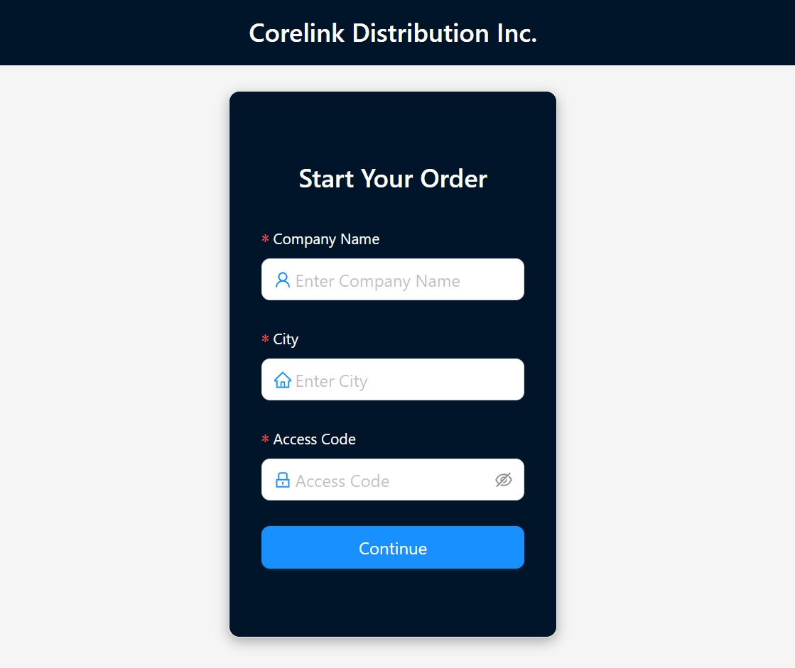
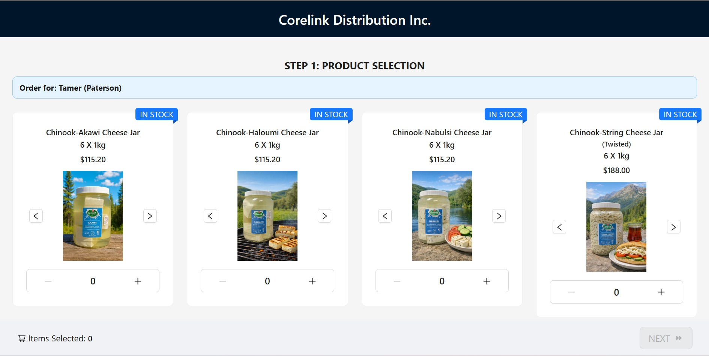
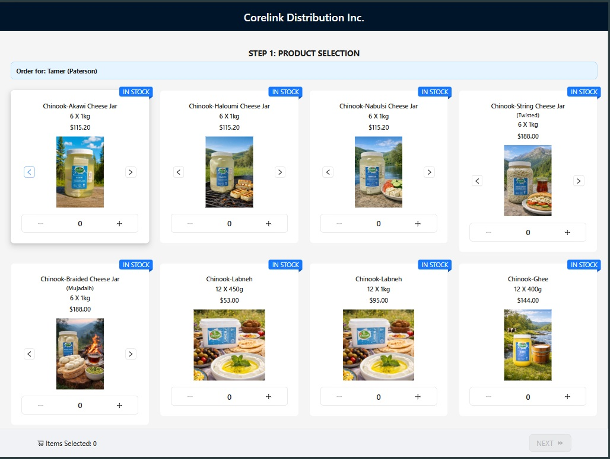
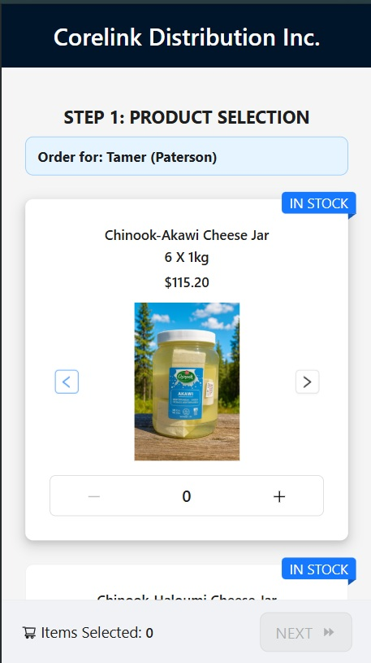
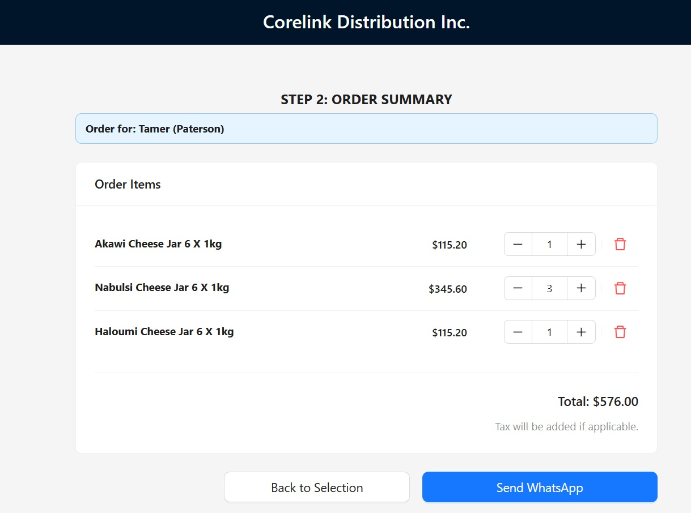
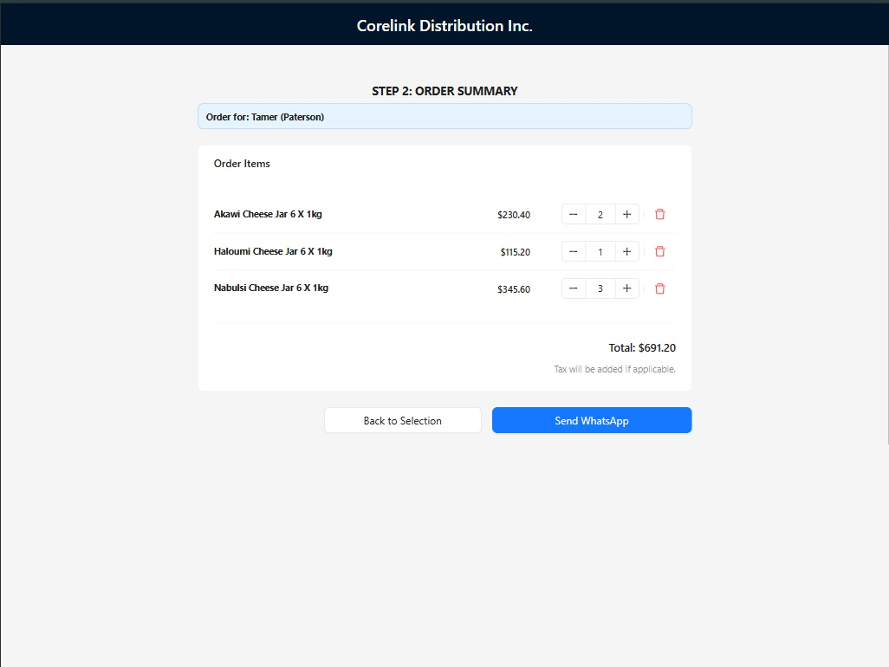
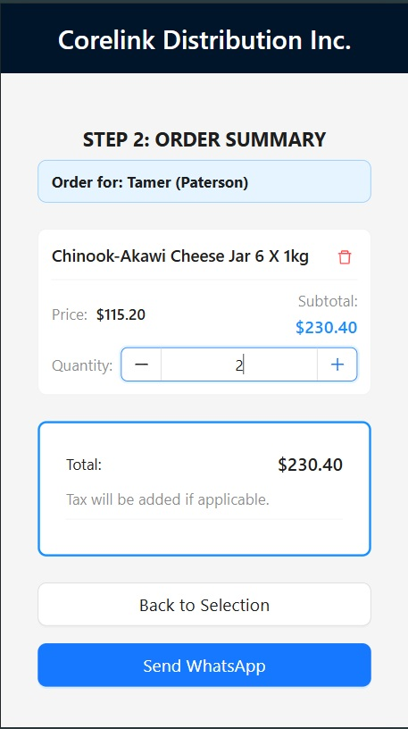

CoreLink Distribution Platform
A high-performance link management and distribution system built with the modern web stack.

🚀 The Vision
CoreLink is designed for scalability and speed. It serves as a central hub for managing and distributing links efficiently, ensuring that startups and businesses can track their digital assets with a "pixel-perfect" user interface and robust logic.

🛠️ Tech Stack
This project showcases a modern, type-safe frontend architecture:

Framework: React & TypeScript for scalable, bug-resistant code.
Styling: Tailwind CSS for a utility-first, responsive design.
Components: Material UI for a polished, professional user experience.
State Management: Optimized for high-performance data flow.

✨ Key Features
Dynamic Link Distribution: Intelligent routing and management of core links.
Responsive Dashboard: Fully optimized for Mobile, Tablet, and Desktop views.
Type-Safe Architecture: Leveraging TypeScript to ensure data integrity across the application.
Performance First: Minimal re-renders and optimized asset loading.

📦 Getting Started
Prerequisites
    Node.js (v18 or higher)
    npm or yarn
    
Installation
    Clone the repository:
    Bash
    git clone https://github.com/tAttia0/corelinkdistribution.git

Install dependencies:
    Bash
    npm install

Start the development server:
Bash
npm start

👨‍💻 About the Developer
I am a Full Stack Developer specializing in Frontend Startup solutions. I bridge the gap between complex business requirements and intuitive user interfaces.

Location: Serving all of New Jersey (NJ/NYC) & Remote.
LinkedIn: www.linkedin.com/in/tattia0
Services: Available for MVP Development, UI/UX Implementation, and Custom Software Solutions.

How to use this:
    Go to your GitHub repo: tAttia0/corelinkdistribution.
    Click the pencil icon to edit the README.md.
    Paste the content above.

## 📱 Responsive UI Showcase
|| Desktop View | Tablet View | Mobile View |
| :--- | :--- | :--- | :--- |
|1st screen |  |  |  |
|2nd screen |  |  |  |
|3rd screen |  |  |  |